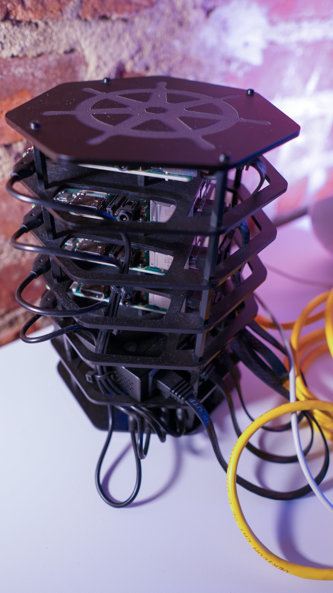

# Kubernetes the fun way

The last few years, I’ve had several thoughts about getting into hobbyist culture behind Raspberry Pi, but have no justification other than it being a fun project or for the share tinkering around. There has always been an interest in running a cluster, since I read about Raspberry Pi Cluster projects on blogs and watch several hours of YouTube videos, wishing I thought of that. Needless to say, this year (2019) would not pass me by without start a personal project. After an unplanned venture to TinkerSphere in New York City with a co-worker, I purchased my very first Raspberry Pi, which furthered my thoughts about building a cluster of Raspberry Pis to tinker with, so why not build a Kubernetes cluster. 

## Why?

The initial inspiration for running Kubernetes on a Raspberry Pi cluster came from reading Kasper Nissen’s blog post on kubecloud.io, the second was to prepare myself for the Certified Kubernetes Administrator (CKA) exam later in the year. That said, I reached out to Kasper on Twitter for further details about the laser cut rack, and I reached out to Fabberz NYC to place an order using his template.

I learn when things don’t work. 

## Target Audience
This tutorial is intended for person who are interested in learning Kubernetes and would like to understand the challenges of running Kubernetes on bare-metal hardware. As the tutorial is aim towards running Kubernetes on ARM, general knowledge will prove to be useful.
> Note This is not intended for a production environment

## Cluster Details
- [Raspbian]()
- [K3s]()
- [Helm](https://helm.sh)
- [Rook]()
- [Argo Tunnel](https://github.com/cloudflare/cloudflare-ingress-controller)

## The Hardware

Below is a list of the hardware that was kindly provided by Lunar Ops, Inc for the Kubernetes Raspberry Pi Cluster.

| Qty | Item | Description |
| --- | --- | --- |
| 4 | [Raspberry Pi 3 B+]() | |
| 4 | [32GB Samsung Pro Plus Micro SDHC card]() | Used for boot drives |
| 4 | [1-ft Cat5e ethernet cable]() | |
| 4 | [128 Samsung USB 3.1 Flash Drive]() | Used for persistent storage |
| 1 | [D-Link 5 Port Gigabit Unmanaged Metal Desktop Switch (DGS-105) Black]() | This was later changed to the Ubiquiti EdgeRouter X. Ubiquiti EdgeRouter X - The router. This provides the Kubernetes cluster with DHCP server |
| 1 | [Anker PowerPort 6 (60W 6-Port USB Charging Hub) with 6 pack Premium 1ft Micro USB]() | Use to provide power to the Raspberry Pi |
| 1 | [8 Piece Black Aluminum Heatsink for Raspberry Pi 3]() | This helps to reduce the head generated on the microchip surface |
|  1 | Custom laser cut black arcylic | *Optional:* by Fabberz NYC (and template by Kasper Nissen) |

