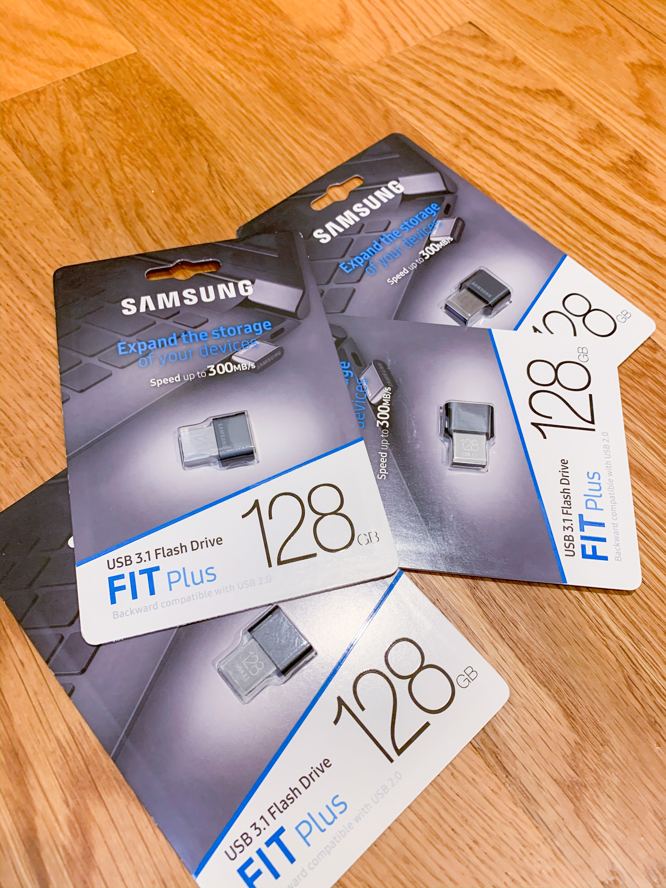

# Storage


```
sudo fdisk -l | grep '^Disk'
sudo mkfs.ext4 /dev/sda1
sudo mkdir /data
sudo mount /dev/sda1 /data

```

`df -H | less`

`sudo vim /etc/fstab`

```
/dev/sda1               /data           ext4    defaults        1 2
```

`kubectl create namespace rook-ceph`
`helm install  rook-ceph --namespace rook-ceph rook-release/rook-ceph  --version v1.0.6`
